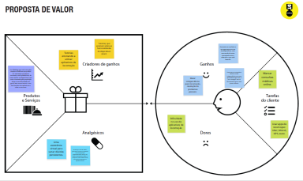
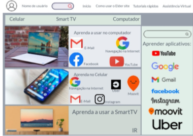

# Informações do Projeto

`TÍTULO DO PROJETO`  

Elder Card

`CURSO` 

Ciências da Computação PUC Minas

## Participantes

 Os membros do grupo são: 

- André Lemos Menezes
- Bernardo Ribeiro Godinho
- Edson Pimenta de Almeida
- Gustavo Vinicius Elias Souza Silva
- Patrick Junio Pereira de Oliveira
- Tales Rocha Moreira

# Estrutura do Documento

- [Informações do Projeto](#informações-do-projeto)
  - [Participantes](#participantes)
- [Estrutura do Documento](#estrutura-do-documento)
- [Introdução](#introdução)
  - [Problema](#problema)
  - [Objetivos](#objetivos)
  - [Justificativa](#justificativa)
  - [Público-Alvo](#público-alvo)
- [Especificações do Projeto](#especificações-do-projeto)
  - [Personas, Empatia e Proposta de Valor](#personas-empatia-e-proposta-de-valor)
  - [Histórias de Usuários](#histórias-de-usuários)
  - [Requisitos](#requisitos)
    - [Requisitos Funcionais](#requisitos-funcionais)
    - [Requisitos não Funcionais](#requisitos-não-funcionais)
  - [Restrições](#restrições)
- [Projeto de Interface](#projeto-de-interface)
  - [User Flow](#user-flow)
  - [Wireframes](#wireframes)
- [Metodologia](#metodologia)
  - [Divisão de Papéis](#divisão-de-papéis)
  - [Ferramentas](#ferramentas)
  - [Controle de Versão](#controle-de-versão)
- [**############## SPRINT 1 ACABA AQUI #############**](#-sprint-1-acaba-aqui-)
- [Projeto da Solução](#projeto-da-solução)
  - [Tecnologias Utilizadas](#tecnologias-utilizadas)
  - [Arquitetura da solução](#arquitetura-da-solução)
- [Avaliação da Aplicação](#avaliação-da-aplicação)
  - [Plano de Testes](#plano-de-testes)
  - [Ferramentas de Testes (Opcional)](#ferramentas-de-testes-opcional)
  - [Registros de Testes](#registros-de-testes)
- [Referências](#referências)

# Introdução

Contemporaneamente, verifica-se que com o grande avanço da tecnologia no cenário mundial, existem pessoas com dificuldade no seu uso, em sua maioria idosos. Nesse sentido, atualmente um dos maiores meios de inclusão social, comunicação,acesso à informação e entretenimento, ocorre pelo uso de dispositivos inteligentes como celulares, notebooks, TVs etc.., e as pessoas que têm dificuldade em seu uso, tendem a ter uma piora em sua qualidade de vida.

Paralelamente, o uso de dispositivos inteligentes pode trazer uma série de benefícios aos idosos. Em primeiro lugar, esses dispositivos podem melhorar sua comunicação, permitindo que eles se conectem com familiares, amigos e outras pessoas com maior facilidade. Além disso, esses dispositivos podem oferecer acesso a informações importantes, como notícias, serviços de saúde e informações de transporte, facilitando a vida cotidiana e mantendo os idosos atualizados sobre o que está acontecendo ao seu redor. Outro benefício é a possibilidade de maior autonomia e independência, tendo acesso a aplicativos e recursos que facilitam o gerenciamento de suas finanças, o planejamento de suas atividades diárias, e até mesmo a assistência em casos de emergência. Isso pode permitir que eles continuem a viver de forma independente e com qualidade de vida, mesmo com limitações físicas ou mobilidade reduzida.

Logo, é de extrema urgência a criação de um WebApp que instrua os idosos a utilizar esses dispositivos inteligentes de forma que seu uso seja uma ferramenta valiosa para que eles possam usufruir de uma melhor qualidade de vida.

## Problema

De acordo com o que foi dito, o problema a ser solucionado com este trabalho é a dificuldade do uso de aparelhos inteligentes por idosos.

## Objetivos

O objetivo geral deste projeto é criar um WebApp com funcionalidades práticas que auxiliem idosos no aprendizado de novas tecnologias em aparelhos inteligentes, de forma a obter uma melhoria substancial em sua qualidade de vida.

Em objetivos específicos, podemos salientar:
 - Criar vídeos simples e fáceis de acessar para cada app e suas funcionalidades.
 - Aplicar uma assistência virtual caso a dúvida persista. 
 - Organizar QR codes  interativos.
 - Demonstrar usabilidade simplificada para fácil entendimento das funcionalidades do site.
 - Esquematizar textos grandes para facilitar a leitura de informações.
 - Propor exercícios de aprendizado.
 - Articular tutoriais explicando cada funcionalidade do nosso webApp.
 - Definir login para acompanhar o progresso do aprendizado.
 - Demonstrar conquistas para cada atividade aprendida.

## Justificativa

Segundo pesquisa desenvolvida por Taiuni Marquine Raymundo na Faculdade de Medicina de Ribeirão Preto (FMRP), foi realizado um estudo com 100 pessoas com +65 anos, e verificou-se que 24% dessas pessoas têm medo de utilizar aparelhos inteligentes, e 40% têm receio quanto a danificar os aparelhos tecnológicos.

Além disso, resultados dessa pesquisa demonstram que é possível superar o medo ao utilizar aparelhos inteligentes, em que quando as pessoas realizaram um curso de inclusão digital notou-se que elas ficaram mais motivadas em aprender sobre as novas tecnologias.

## Público-Alvo

Ainda que muitas pessoas possam se beneficiar com as instruções de aprendizagem do WebApp, o objetivo pensado nesse projeto está nos idosos que sentem dificuldade de se incluírem no meio digital.

Portanto, foi estabelecido como público alvo, homens e mulheres com mais de 65 anos que sentem necessidade de se comunicar, utilizar serviços de transporte, navegar na internet livremente e se entreterem, através de dispositivos e apps smart.

# Especificações do Projeto

O esclarecimento exato do nosso problema assim como os tópicos importantes a serem tratados foram definidos através da participação de prováveis usuários usando de entrevistas e observações. Dessa forma, tais conclusões foram levantadas por meio da elaboração de personas e experiências de usuários.

## Personas, Empatia e Proposta de Valor

As personas elaboradas ao longo do processo de conhecimento do problema são apresentadas a seguir:

Persona 1:

Proposta de Valor:

Persona 2:

Proposta de Valor:

Persona 3:

Proposta de Valor:

## Histórias de Usuários

|EU COMO... `PERSONA`| QUERO/DESEJO ... `FUNCIONALIDADE` |PARA ... `MOTIVO/VALOR`                 |
|--------------------|------------------------------------|----------------------------------------|
|Vera Silveira | Comunicar de forma simples e rápida com filhos e netos. | Não ser isolada da família. |
|Vera Silveira | Utilizar, na sua total funcionalidade, o app do banco. | Conseguir realizar suas transações sem ter que pedir ajuda a terceiros. |
|José Carlos da Cruz |Acompanhar as principais e mais relevantes fatos que estão acontecendo no mundo através das notícias. |Se manter atualizado no que diz respeito às atualidades. |
|José Carlos da Cruz |Baixar livros em pdf com qualidade e ter a capacidade de lê-los com facilidade. |Adaptar seu hobbie preferido ao mundo moderno e suas tecnologias. |
|Josiane Alves |Usar apps como uber, moovit com facilidade. |Não perder tempo consultando colegas de trabalho. |

## Requisitos do Projeto

O alcance funcional do projeto é estabelecido através das exigências funcionais que especificam as oportunidades de interação dos utilizadores, bem como os requisitos não funcionais que descrevem as características que o sistema deverá apresentar de forma ampla. Essas exigências são exibidas abaixo.

### **Requisitos Funcionais**

A tabela a seguir apresenta os requisitos do projeto, identificando a prioridade em que os mesmos devem ser entregues.

| ID    | Descrição do Requisito  | Prioridade |
|--------------------|---------------------------|----------------|
|RF-01  | O principal meio de entrar no site, será por um QR code, que virá num cartão, para facilitar a entrada do usuário no site, e evitar de que o idoso tenha que pesquisar no navegador. | ALTA |
|RF-02  | O site deve ser o mais compreensivo possível, com letras grandes e com linguagem simples, para melhor entendimento do usuário acima de 70 anos.| ALTA |
|RF-03  | O site deve conter sempre ícones dos aplicativos que terão tutoriais, para melhor compreensão. | ALTA | 
|RF-04| O site deve oferecer um menu simples, com opções na parte superior da tela, que permita escolher o dispositivo desejado (celular, notebook, ou TV(de inicio estes dispositivos))   | ALTA |
|RF-05| O site deve oferecer uma barra de pesquisa para que o usuário possa pesquisar uma informação direto se não quiser acessar o Menu. | MÉDIA | 
|RF-06| O site deverá ser responsivo permitindo a visualização em um celular de forma adequada   | ALTA |
|RF-07| O site deve permitir o compartilhamento dos tutoriais e instruções de uso dos apps visualizadas em plataformas de redes sociais | ALTA | 
|RF-08| O site deve permitir salvar tutoriais preferidas, pois os usuários estão em uma faixa etária onde precisam de um uso mais simples   | ALTA |
|RF-09| O site deve disponibilizar um tipo de assistência virtual caso a dúvida persista. | MÉDIA | 
|RF-10| O site deve conter um ChatBot para responder as dúvidas diretas dos usuários   | BAIXA |
|RF-11| O site deve exibir comentários abaixo da página de tutoriais, para que outros usuários possam responder seu comentário, respondendo assim eventuais dúvidas   | ALTA |
|RF-12| O site deve conter um ChatBot para responder o usuário   | BAIXA |

### **Requisitos não Funcionais**

A tabela a seguir apresenta os requisitos não funcionais que o projeto deverá atender.

|ID     | Descrição do Requisito  |Prioridade |
|-------|-------------------------|----|
|RNF-01| O site deve ser publicado em um ambiente acessível publicamente na Internet (Replit, GitHub Pages, Heroku) | ALTA | 
|RNF-02| O site deve ter bom nível de contraste entre os elementos da tela em conformidade. |  MÉDIA |
|RNF-03|O site deve ser compatível com os principais navegadores do mercado (Google Chrome, Firefox, Microsoft Edge) |  ALTA | 

## Restrições

As questões que limitam a execução desse projeto e que se configuram como obrigações claras para o desenvolvimento do projeto em questão são apresentadas na tabela a seguir.

|ID| Restrição                                             |
|--|-------------------------------------------------------|
|RE-01| O projeto deverá ser entregue no final do semestre letivo, não podendo extrapolar a data de 12/07/2023. |
|RE-02| O aplicativo deve se restringir às tecnologias básicas da Web no Frontend.|
|RE-03| A equipe não pode subcontratar o desenvolvimento do trabalho.|

# Projeto de Interface

Dentre as preocupações para a montagem da interface do sistema, estamos estabelecendo foco em questões como agilidade, acessibilidade e usabilidade. Desta forma, o projeto tem uma identidade visual padronizada em todas as telas que são projetadas para funcionamento em desktops e dispositivos móveis.

# Fluxo do Usuário

O diagrama apresentado na Figura mostra o fluxo de interação do usuário pelas telas do sistema. Cada uma das telas deste fluxo é detalhada na seção de Wireframes que se segue. Para visualizar o wireframe interativo, acesse o ambiente [MarvelApp](https://marvelapp.com/4hd6091) do projeto.

**Exemplo**:

# Wireframes

Conforme fluxo de telas do projeto, apresentado no item anterior, as telas do sistema são apresentadas em detalhes nos itens que se seguem. As telas do sistema apresentam uma estrutura comum que é apresentada na Figura. Nesta estrutura, existem 3 grandes blocos, descritos a seguir. São eles:
- **Cabeçalho** - local onde são dispostos elementos fixos de identidade (logo) e navegação principal do site (menu da aplicação);
- **Conteúdo** - apresenta o conteúdo da tela em questão;
- **Barra lateral** - apresenta os elementos de navegação secundária, geralmente associados aos elementos do bloco de conteúdo.

## Tela - Home-Page

A tela de home-page mostra notícias de destaque a partir da API utilizada pelo sistema. Com base na estrutura padrão, o bloco de Conteúdo traz as notícias em destaque (imagem, título, data, fonte e resumo, ícone de compartilhamento). O bloco da Barra Lateral traz três elementos distintos:
- Componente de **pesquisa** que permite substituir o conteúdo da página com o resultado da busca solicitada pelo usuário;
- Componente de **notícias preferidas** que leva o usuário para a tela de Notícias Preferidas;
- Componente de **lista de categorias** que dá acesso às páginas de cada uma das seções disponibilizadas.

## Tela - Escolhas de categorias

A tela de escolhas de categoria apresenta, no Bloco de Conteúdo, as opções referentes a uma categoria específica, escolhida pelo usuário. O Bloco de Barra Lateral apresenta os mesmos elementos da Home-Page. 

## Tela - Resultado de Pesquisa

Assim que o usuário informa um tópico de pesquisa, ao clicar no botão Ok, ele é direcionado para uma tela que traz a relação de notícias associadas ao tópico informado. Este resultado é apresentado na Figura a seguir.

## Tela - Leitura de Conteúdo

A tela de Leitura de Conteúdo apresenta, no Bloco de Conteúdo, um tutorial específico. Não é necessário ter uma barra lateral pois não é mais preciso ter atalhos aquela altura, e atrapalharia a visibilidade do bloco de tutorial do usuário devido ao espaço, o que é péssimo para um idoso , que normalmente tem dificuldades de enxergar as letras. Caso queira ir para outro tutorial, basta acessar essa seção na barra superior do menu. 

## Tela - Salvar Tutoriais Preferidos

A tela que permite o salvamento de tutorias preferidos é uma janela modal (surge sobre outras janelas) quando o usuário pressiona o ícone coração na tela de Leitura de Notícia. Nesta tela, a notícia a ser salva é visualizada e o usuário pode informar um tópico ou escolher entre os já cadastrados. Em seguida deve confirmar ou cancelar o salvamento. Na sequência, a tela é fechada voltando para o ambiente anterior.

## Tela - Tutoriais Preferidos

A tela de Tutoriais Preferidos apresenta a relação de tutoriais salvos pelo usuário. Nesta tela, os tutoriais são separados pelo Tópico informado pelo usuário. Os tópicos servem como um agrupamento dos tutoriais salvos. Ao clicar em uma tutorial é disparada a tela de visualização de notícia. O Bloco de Barra Lateral apresenta os mesmos elementos da Home-Page. 

## Tela - Comentários

Na tela que permite ao usuário comentar um tutorial, deve-se informar o nome de quem está comentando e o texto do comentário. Esta tela é exibida na forma de uma janela modal. Em seguida, deve-se confirmar ou cancelar o salvamento do comentário. Na sequência, a tela é fechada voltando para o ambiente anterior.

# Metodologia

A metodologia contempla as definições de ferramental utilizado pela equipe tanto para a manutenção dos códigos e demais artefatos quanto para a organização do time na execução das tarefas do projeto.

## Gerenciamento do Projeto

A equipe utiliza metodologias ágeis, tendo escolhido o Scrum como base para definição do processo de desenvolvimento.

A equipe está organizada da seguinte maneira:
- Scrum Master: Edson Pimenta
- Product Owner: Tales Rocha
- Equipe de Desenvolvimento:
- André Lemos (Desenvolvedor Front End)
- Edson Pimenta (Desenvolvedor Front End)
- Bernardo  (Desenvolvedor Front End)
- Patrick Junio Pereira (Desenvolvedor Front End)
- Tales Rocha (Designer)
- Gustavo Vinicius (Designer)

Para organização e distribuição das tarefas do projeto, a equipe está utilizando o Trello estruturado com as seguintes listas: 

- **Recursos**: esta lista mantém um template de tarefas recorrentes com as configurações padronizadas que todos devem seguir. O objetivo é permitir a cópia destes templates para agilizar a criação de novos cartões.
- **Backlog**: recebe as tarefas a serem trabalhadas e representa o Product Backlog. Todas as atividades identificadas no decorrer do projeto também devem ser incorporadas a esta lista.
- **To Do**: Esta lista representa o Sprint Backlog. Este é o Sprint atual que estamos trabalhando.
Doing: Quando uma tarefa tiver sido iniciada, ela é movida para cá.
- **Test**: Checagem de Qualidade. Quando as tarefas são concluídas, eles são movidas para o “CQ”. No final da semana, eu revejo essa lista para garantir que tudo saiu perfeito.
- **Done**: nesta lista são colocadas as tarefas que passaram pelos testes e controle de qualidade e estão prontos para ser entregues ao usuário. Não há mais edições ou revisões necessárias, ele está agendado e pronto para a ação.
- **Locked**: Quando alguma coisa impede a conclusão da tarefa, ela é movida para esta lista juntamente com um comentário sobre o que está travando a tarefa.

O quadro kanban do grupo no Trello está disponível através da URL https://trello.com/b/LupglzUz/tiaw-template e é apresentado, no estado atual, na Figura a seguir. A definição desta estrutura se baseou na proposta feita por Littlefield (2016).

A tarefas são, ainda, etiquetadas em função da natureza da atividade e seguem o seguinte esquema de cores/categorias:
- Documentação
- Desenvolvimento 
- Infraestrutura
- Testes
- Gerência de Projetos.

## Relação de Ambientes de Trabalho

Os artefatos do projeto são desenvolvidos a partir de diversas plataformas e a relação dos ambientes com seu respectivo propósito é apresentada na tabela que se segue. 

| Ambiente  | Plataforma              |Link de Acesso |
|-----------|-------------------------|---------------|
|Repositório de código fonte | GitHub |  https://github.com/ICEI-PUC-Minas-PMGCC-TI/ti-1-pmg-cc-m-20231-tiaw-eldercard | 
|Documentos do projeto | Google Docs |https://docs.google.com/document/d/1lTU36uTLjBslXGsmYWcu4YG34Ysiqnems0r0DItvpuM/edit# | 
|Projeto de Interface e  Wireframes | MarvelApp |  https://marvelapp.com/projects/my | 
|Gerenciamento do Projeto | Trello | https://trello.com/b/skpJw0qd/tial-projeto-inclus%C3%A3o-digital-de-idosos | 

## Gestão de código fonte

Para gestão do código fonte do software desenvolvido pela equipe, o grupo utiliza um processo baseado no **Git Feature Branch Workflow**, mostrado na Figura a seguir. Desta forma, todas as manutenções no código são realizadas em branches separados. Uma explicação rápida sobre este processo é apresentada no site "[5 Git Workflows & Branching Strategy to deliver better code](https://zepel.io/blog/5-git-workflows-to-improve-development/)".

# **############## SPRINT 1 ACABA AQUI #############**

# Projeto da Solução

......  COLOQUE AQUI O SEU TEXTO ......

## Tecnologias Utilizadas

......  COLOQUE AQUI O SEU TEXTO ......

> Descreva aqui qual(is) tecnologias você vai usar para resolver o seu
> problema, ou seja, implementar a sua solução. Liste todas as
> tecnologias envolvidas, linguagens a serem utilizadas, serviços web,
> frameworks, bibliotecas, IDEs de desenvolvimento, e ferramentas.
> Apresente também uma figura explicando como as tecnologias estão
> relacionadas ou como uma interação do usuário com o sistema vai ser
> conduzida, por onde ela passa até retornar uma resposta ao usuário.
> 
> Inclua os diagramas de User Flow, esboços criados pelo grupo
> (stoyboards), além dos protótipos de telas (wireframes). Descreva cada
> item textualmente comentando e complementando o que está apresentado
> nas imagens.

## Arquitetura da solução

......  COLOQUE AQUI O SEU TEXTO E O DIAGRAMA DE ARQUITETURA .......

> Inclua um diagrama da solução e descreva os módulos e as tecnologias
> que fazem parte da solução. Discorra sobre o diagrama.
> 
> **Exemplo do diagrama de Arquitetura**:
> 
> 

# Avaliação da Aplicação

......  COLOQUE AQUI O SEU TEXTO ......

> Apresente os cenários de testes utilizados na realização dos testes da
> sua aplicação. Escolha cenários de testes que demonstrem os requisitos
> sendo satisfeitos.

## Plano de Testes

......  COLOQUE AQUI O SEU TEXTO ......

> Enumere quais cenários de testes foram selecionados para teste. Neste
> tópico o grupo deve detalhar quais funcionalidades avaliadas, o grupo
> de usuários que foi escolhido para participar do teste e as
> ferramentas utilizadas.
> 
> **Links Úteis**:
> - [IBM - Criação e Geração de Planos de Teste](https://www.ibm.com/developerworks/br/local/rational/criacao_geracao_planos_testes_software/index.html)
> - [Práticas e Técnicas de Testes Ágeis](http://assiste.serpro.gov.br/serproagil/Apresenta/slides.pdf)
> -  [Teste de Software: Conceitos e tipos de testes](https://blog.onedaytesting.com.br/teste-de-software/)

## Ferramentas de Testes (Opcional)

......  COLOQUE AQUI O SEU TEXTO ......

> Comente sobre as ferramentas de testes utilizadas.
> 
> **Links Úteis**:
> - [Ferramentas de Test para Java Script](https://geekflare.com/javascript-unit-testing/)
> - [UX Tools](https://uxdesign.cc/ux-user-research-and-user-testing-tools-2d339d379dc7)

## Registros de Testes

......  COLOQUE AQUI O SEU TEXTO ......

> Discorra sobre os resultados do teste. Ressaltando pontos fortes e
> fracos identificados na solução. Comente como o grupo pretende atacar
> esses pontos nas próximas iterações. Apresente as falhas detectadas e
> as melhorias geradas a partir dos resultados obtidos nos testes.

# Referências

......  COLOQUE AQUI O SEU TEXTO ......

> Inclua todas as referências (livros, artigos, sites, etc) utilizados
> no desenvolvimento do trabalho.
> 
> **Links Úteis**:
> - [Formato ABNT](https://www.normastecnicas.com/abnt/trabalhos-academicos/referencias/)
> - [Referências Bibliográficas da ABNT](https://comunidade.rockcontent.com/referencia-bibliografica-abnt/)
